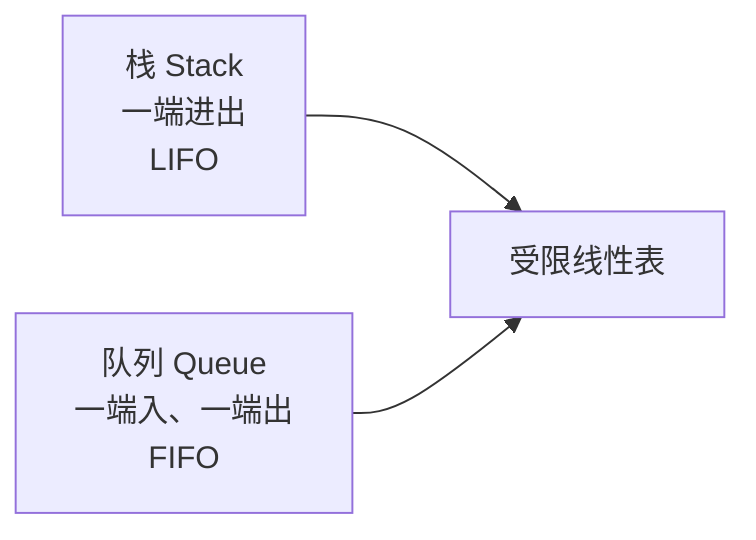

## 栈和队列

栈和队列都是**受限的线性表**：栈只允许在一端操作，遵循**后进先出（LIFO）**；队列在一端插入、另一端删除，遵循**先进先出（FIFO）**。



### 本章重点

- 顺序栈、共享栈、链栈的定义和基本操作。
- 栈的上溢、下溢，括号匹配、表达式求值、中缀转后缀和递归。
- 顺序队列的假溢出、循环队列的判空/判满和长度公式。
- 链队列的入队、出队，以及删除最后一个结点时的指针维护。
- 双端队列、优先队列、BFS 和层次遍历等应用。

---

## 栈（Stack）

### 定义和术语

栈是限定仅在表尾进行插入和删除操作的线性表。允许操作的一端叫**栈顶**，另一端叫**栈底**。插入称为入栈（push），删除称为出栈（pop）。

```text
入栈 push                         出栈 pop
    ↓                               ↑
┌────────┐                      ┌────────┐
│  栈顶  │                      │  栈顶  │
├────────┤                      ├────────┤
│        │                      │        │
├────────┤                      ├────────┤
│  栈底  │                      │  栈底  │
└────────┘                      └────────┘
```

基本操作包括：初始化、销毁、清空、判空、求长度、读取栈顶、入栈和出栈。

## 顺序栈

顺序栈用地址连续的数组保存元素。下面约定 `top` 表示当前元素个数，栈顶元素位于 `data[top - 1]`。

```cpp
#include <iostream>
using namespace std;

const int MAXSIZE = 100;
using ElemType = int;

struct SqStack {
    ElemType data[MAXSIZE]; // 栈的存储空间
    int top;                // 元素个数，空栈为 0
};

void InitStack(SqStack& S) { S.top = 0; }
bool StackEmpty(const SqStack& S) { return S.top == 0; }
bool StackFull(const SqStack& S) { return S.top == MAXSIZE; }
```

### 入栈、出栈和取栈顶

```cpp
bool Push(SqStack& S, ElemType e) {
    if (StackFull(S)) return false; // 上溢：栈已满
    S.data[S.top++] = e;
    return true;
}

bool Pop(SqStack& S, ElemType& e) {
    if (StackEmpty(S)) return false; // 下溢：栈为空
    e = S.data[--S.top];
    return true;
}

bool GetTop(const SqStack& S, ElemType& e) {
    if (StackEmpty(S)) return false;
    e = S.data[S.top - 1];
    return true;
}

void ClearStack(SqStack& S) { S.top = 0; }
```

顺序栈的 `Push`、`Pop`、`GetTop`、判空和判满都为 $O(1)$，空间复杂度为 $O(n)$。静态数组容量固定，满栈后不能继续入栈。

## 共享栈

两个栈可以共享同一数组：栈 1 从左向右增长，栈 2 从右向左增长。设 `top1=-1`、`top2=MAXSIZE`，当 `top1+1==top2` 时空间用尽。

```cpp
struct SharedStack {
    int data[MAXSIZE];
    int top1; // 向右增长
    int top2; // 向左增长
};

void InitSharedStack(SharedStack& S) {
    S.top1 = -1;
    S.top2 = MAXSIZE;
}

bool Push1(SharedStack& S, int e) {
    if (S.top1 + 1 == S.top2) return false;
    S.data[++S.top1] = e;
    return true;
}

bool Push2(SharedStack& S, int e) {
    if (S.top1 + 1 == S.top2) return false;
    S.data[--S.top2] = e;
    return true;
}
```

共享栈适合两个栈的空间需求具有互补性、但无法预先准确分配容量的情况。

## 链栈

链栈通常把单链表的头部作为栈顶，入栈和出栈均为 $O(1)$。

```cpp
struct StackNode {
    int data;
    StackNode* next;
};
using LinkStack = StackNode*;

bool Push(LinkStack& S, int e) {
    StackNode* p = new StackNode{e, S}; // 新结点插入表头
    S = p;
    return true;
}

bool Pop(LinkStack& S, int& e) {
    if (S == nullptr) return false;
    StackNode* p = S;
    e = p->data;
    S = S->next;
    delete p;
    return true;
}
```

链栈不需要预先规定容量，但每个元素需要额外指针域；若把栈顶放在单链表尾部，出栈需要找前驱，会退化为 $O(n)$。

---

## 栈的典型应用

### 括号匹配

扫描字符串：左括号入栈；右括号必须与栈顶匹配后出栈；扫描结束时栈必须为空。

```cpp
#include <stack>
#include <string>
using namespace std;

bool Match(char l, char r) {
    return (l == '(' && r == ')') ||
           (l == '[' && r == ']') ||
           (l == '{' && r == '}');
}

bool BracketMatch(const string& s) {
    stack<char> st;
    for (char ch : s) {
        if (ch == '(' || ch == '[' || ch == '{') st.push(ch);
        else if (ch == ')' || ch == ']' || ch == '}') {
            if (st.empty() || !Match(st.top(), ch)) return false;
            st.pop();
        }
    }
    return st.empty();
}
```

时间复杂度 $O(n)$，最坏空间复杂度 $O(n)$。

### 中缀、后缀和前缀表达式

以 `A+B*C` 为例：中缀为 `A+B*C`，后缀为 `ABC*+`，前缀为 `+A*BC`。后缀表达式不需要括号和优先级比较，适合用栈求值。

中缀转后缀的规则：操作数直接输出；左括号入栈；右括号弹出直到左括号；遇运算符时弹出栈内优先级不低于它的运算符，然后将当前运算符入栈；最后弹出剩余运算符。

```cpp
#include <cctype>
#include <stack>
#include <string>
using namespace std;

int Priority(char op) {
    if (op == '+' || op == '-') return 1;
    if (op == '*' || op == '/') return 2;
    return 0;
}

string InfixToPostfix(const string& infix) {
    stack<char> ops;
    string out;
    for (size_t i = 0; i < infix.size();) {
        char ch = infix[i];
        if (isdigit(static_cast<unsigned char>(ch))) {
            while (i < infix.size() && isdigit(static_cast<unsigned char>(infix[i])))
                out += infix[i++]; // 支持多位整数
            out += ' ';
        } else if (ch == '(') {
            ops.push(ch); ++i;
        } else if (ch == ')') {
            while (!ops.empty() && ops.top() != '(') {
                out += ops.top(); out += ' '; ops.pop();
            }
            if (!ops.empty()) ops.pop();
            ++i;
        } else if (ch == '+' || ch == '-' || ch == '*' || ch == '/') {
            while (!ops.empty() && ops.top() != '(' &&
                   Priority(ops.top()) >= Priority(ch)) {
                out += ops.top(); out += ' '; ops.pop();
            }
            ops.push(ch); ++i;
        } else ++i; // 忽略空格
    }
    while (!ops.empty()) { out += ops.top(); out += ' '; ops.pop(); }
    return out;
}
```

后缀求值时，遇到操作数入栈，遇到运算符连续弹出两个数。**先弹出的是右操作数，后弹出的是左操作数**。

```cpp
int Apply(int left, int right, char op) {
    if (op == '+') return left + right;
    if (op == '-') return left - right;
    if (op == '*') return left * right;
    if (op == '/' && right != 0) return left / right;
    throw runtime_error("invalid operation");
}
```

### 递归和回溯

函数调用时，返回地址、参数和局部变量会压入系统调用栈；函数返回时按相反顺序弹出。递归必须有递归出口，并且每次调用都使问题规模变小。

```cpp
long long Factorial(int n) {
    if (n <= 1) return 1; // 递归出口
    return n * Factorial(n - 1);
}
```

迷宫、全排列、八皇后等回溯问题也可显式使用栈：做出选择就入栈，走到死路就出栈撤销最近选择。

---

## 队列（Queue）

队列只允许在一端插入、另一端删除。插入的一端叫**队尾 rear**，删除的一端叫**队头 front**。

```text
出队 ← 队头 [a1][a2][a3][a4] 队尾 → 入队
                 FIFO
```

## 循环队列

普通顺序队列中 `front` 和 `rear` 只向右移动，容易出现“数组前面有空位但队尾到达末端”的假溢出。循环队列将数组首尾相连，用取模实现回绕。

下面采用最常见的“牺牲一个存储单元”约定：`front` 指向队头元素，`rear` 指向下一个入队位置。

$$
队空：front = rear
$$

$$
队满：(rear+1)\bmod MAXSIZE = front
$$

$$
队列长度=(rear-front+MAXSIZE)\bmod MAXSIZE
$$

```cpp
const int MAXSIZE = 100;
struct CircularQueue {
    int data[MAXSIZE];
    int front; // 队头元素位置
    int rear;  // 下一个入队位置
};

void InitQueue(CircularQueue& Q) { Q.front = Q.rear = 0; }
bool QueueEmpty(const CircularQueue& Q) { return Q.front == Q.rear; }
bool QueueFull(const CircularQueue& Q) {
    return (Q.rear + 1) % MAXSIZE == Q.front;
}
int QueueLength(const CircularQueue& Q) {
    return (Q.rear - Q.front + MAXSIZE) % MAXSIZE;
}

bool EnQueue(CircularQueue& Q, int e) {
    if (QueueFull(Q)) return false;
    Q.data[Q.rear] = e;
    Q.rear = (Q.rear + 1) % MAXSIZE;
    return true;
}

bool DeQueue(CircularQueue& Q, int& e) {
    if (QueueEmpty(Q)) return false;
    e = Q.data[Q.front];
    Q.front = (Q.front + 1) % MAXSIZE;
    return true;
}

bool GetHead(const CircularQueue& Q, int& e) {
    if (QueueEmpty(Q)) return false;
    e = Q.data[Q.front];
    return true;
}
```

若不想牺牲一个单元，可额外维护 `size`（当前元素个数）或 `tag`（记录最近一次是入队还是出队）来区分队空和队满。考试中默认优先写“牺牲一个单元”的版本。

## 链队列

链队列通常带头结点，`front` 指向头结点，`rear` 指向最后一个数据结点；空队列时 `front == rear`。

```cpp
struct QueueNode {
    int data;
    QueueNode* next;
};
struct LinkQueue {
    QueueNode* front;
    QueueNode* rear;
};

void InitQueue(LinkQueue& Q) {
    Q.front = Q.rear = new QueueNode;
    Q.front->next = nullptr;
}

void EnQueue(LinkQueue& Q, int e) {
    QueueNode* p = new QueueNode{e, nullptr};
    Q.rear->next = p;
    Q.rear = p;
}

bool DeQueue(LinkQueue& Q, int& e) {
    if (Q.front == Q.rear) return false;
    QueueNode* p = Q.front->next;
    e = p->data;
    Q.front->next = p->next;
    if (Q.rear == p) Q.rear = Q.front; // 删除最后一个结点后的关键处理
    delete p;
    return true;
}
```

链队列入队、出队均为 $O(1)$，空间复杂度为 $O(n)$。链式结构没有固定容量，但每个结点需要额外指针域。

---

## 双端队列和优先队列

双端队列（Deque）允许在队头、队尾两端插入和删除；输入受限或输出受限的双端队列只限制其中一种操作。优先队列的出队顺序由优先级决定，常用堆实现，插入和删除最高优先级元素通常为 $O(\log n)$。

---

## 队列的典型应用

### 层次遍历和 BFS

树的层次遍历、图的广度优先搜索都会使用队列保存“已发现但尚未处理”的结点。

```cpp
queue<int> Q;
visited[start] = true;
Q.push(start);
while (!Q.empty()) {
    int u = Q.front(); Q.pop();
    for (int v : graph[u]) {
        if (!visited[v]) {
            visited[v] = true;
            Q.push(v);
        }
    }
}
```

### 缓冲区和任务调度

打印任务、CPU 时间片轮转、网络数据包、生产者—消费者模型都可以抽象为队列。固定大小缓冲区特别适合使用循环队列。

---

## 栈和队列比较

| 对比项 | 栈 | 队列 |
| --- | --- | --- |
| 插入位置 | 栈顶 | 队尾 |
| 删除位置 | 栈顶 | 队头 |
| 访问顺序 | LIFO | FIFO |
| 典型实现 | 顺序栈、链栈 | 循环队列、链队列 |
| 典型应用 | 递归、括号、表达式、回溯 | BFS、层次遍历、缓冲区、调度 |

## 易错点与复杂度总结

1. `top` 的定义要统一。本笔记中顺序栈 `top` 是元素个数，栈顶下标为 `top-1`。
2. 后缀表达式运算时，先弹出的是右操作数。
3. 循环队列不能同时用 `front==rear` 表示空和满；默认牺牲一个单元，或增加 `size/tag`。
4. 循环队列长度必须写成 `(rear-front+MAXSIZE)%MAXSIZE`，避免负数。
5. 链队列删除最后一个元素后，必须令 `rear=front`，否则会留下野指针。
6. 链栈的栈顶放在表头，才能保证出栈为 $O(1)$。
7. 递归深度过大仍会栈溢出。

| 结构 | 取顶/取头 | 插入 | 删除 | 空间 |
| --- | ---: | ---: | ---: | ---: |
| 顺序栈 | $O(1)$ | $O(1)$ | $O(1)$ | $O(n)$ |
| 链栈 | $O(1)$ | $O(1)$ | $O(1)$ | $O(n)$ |
| 循环队列 | $O(1)$ | $O(1)$ | $O(1)$ | $O(n)$ |
| 链队列 | $O(1)$ | $O(1)$ | $O(1)$ | $O(n)$ |

## 复习清单

- [ ] 会写顺序栈 `Push`、`Pop`、`GetTop`。
- [ ] 会解释上溢、下溢以及共享栈满栈条件。
- [ ] 会用栈完成括号匹配和表达式处理。
- [ ] 会说明递归与系统调用栈的关系。
- [ ] 会写循环队列判空、判满、入队、出队和长度公式。
- [ ] 会写带头结点链队列，并处理删除最后一个结点的情况。
- [ ] 能区分栈、队列、双端队列、优先队列的操作限制和应用场景。
